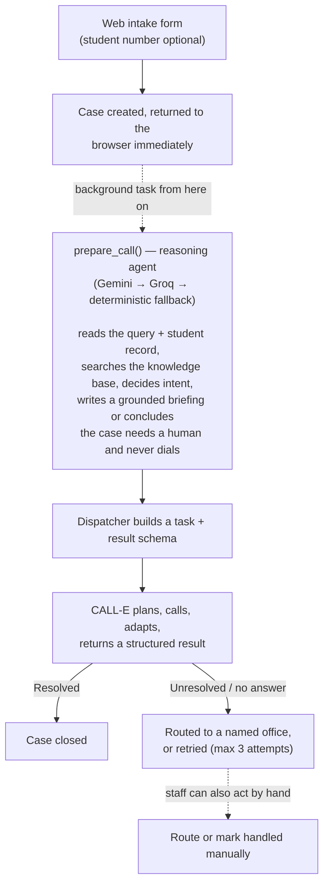

# Ringback

**[Demo video — add link here before submission]**

**A callback-first front door for university admin offices, built on CALL-E.** Students leave a query; CALL-E calls back and resolves it.

A student fills in a fifteen-second web form and hangs up on nothing, because there was never a call to hang up on. Ringback reasons about the query, pulls their record (or the right knowledge-base article, if they're not a registered student), and dispatches a CALL-E agent to resolve it — or routes it to the one named person who can, with the full context already attached.

Built for [CALL-E: Your Code Is Calling](https://call-e.devpost.com). Reference deployment: Namibia University of Science and Technology (NUST), Windhoek.

## The problem, specifically

| Inconvenience | How Ringback answers it |
|---|---|
| **Long hold times** | No hold. 15-second form, CALL-E calls back within minutes. |
| **Repetitive storytelling** | The query is captured once and travels into the call, the result, and any escalation. Nobody re-explains anything. |
| **Dropped calls** | Lives in a database, not a queue. Failed/unanswered calls retry automatically (up to 3) before flagging for a manual callback. |

Every answer comes from the student's record or a knowledge-base file, never from an agent's memory — two people asking the same question get the same answer. What Ringback doesn't claim: beating a dead-end IVR menu. It removes the IVR. An unresolved query gets a named office, a named contact, and a one-line reason — never a loop.

## How it works



The dashboard polls every 2 seconds — no websockets — so a case's status visibly updates on its own.

## Two agents, different jobs

**Ringback's reasoning agent runs before the call.** It reads the query and the student's record, searches the knowledge base (more than once if needed), and either writes a grounded briefing or decides the case needs a human and never dials — that's where the disclosure boundary lives (a parent asking about their child's balance gets routed, not called).

**CALL-E is the agent on the phone.** It plans the call, adapts to what the student says, handles interruptions and voicemail, and returns a structured result. Ringback can't intervene mid-call, so the briefing has to be complete before the phone rings.

Everything else — dispatch, polling, retries, routing — is plain deterministic code.

**Reasoning chain:** Gemini → Groq → keyword+retrieval fallback, each one degrading to the next rather than failing the case. A 429 fails over to the next provider immediately (no point retrying an exhausted quota); any other error retries once first. Both model providers get a tight 2-call budget (search once, then answer) for latency — a genuinely two-step question can occasionally miss that budget on both providers, in which case it still resolves, just via the simpler fallback instead of full reasoning. Every case's final decision is logged (`prepare: decision case=...`) so that's visible after the fact, not just inferred.

## Scope: three intents, on purpose

1. **Proof of registration** — confirm identity, check status, explain if it's ready or blocked by a fee balance.
2. **Subject cancellation** — confirm the subject, check the drop deadline, explain any fee implication.
3. **Anything else** — deliberately unresolvable by design, always routes to a named office with context attached. This is the feature, not a fallback.

## How CALL-E is used

`app/calle_client.py` is the only file that talks to CALL-E — `POST /v1/calls` to dispatch, `GET /v1/calls/{id}` polled for status/result/transcript. Never re-fires a call with a stale id; a retry always dispatches fresh.

**Live today:** `CALLE_API_KEY` is configured, real calls have resolved end-to-end. A local mock transport (deterministic per-phone outcomes) is still used by the test suite and was how the pipeline was built before the account existed.

## Known limitations

- **Most CALL-E lines are international, not local** — including Namibia's. Only 7 of 42 supported countries (US, SG, MY, AE, AU, MX, BR) are `Local`; the rest, verified directly against CALL-E's own docs, ring from an international number. The intake form's country dropdown flags this per-country so a caller still answers.
- **TF-IDF retrieval is lexical, not semantic** — a paraphrased question can score below the relevance threshold and get no reference material, by design (an honest "I'll have someone follow up" beats a confidently wrong answer read aloud on a call). Embeddings would close this gap; not built yet (`EmbeddingRetriever` is a documented, one-line swap behind the same protocol).
- **Single process, SQLite-or-Postgres, in-process polling.** Fine for a hackathon dashboard; would need a real task queue at scale.
- **Curation gaps show up as invented answers, not silence.** A taxonomy sweep caught the reasoning agent inventing visa/permit specifics from a KB with almost no real coverage — fixed by curating the actual source document rather than just prompting harder. Worth remembering when adding a new tenant: an uncurated topic doesn't fail safely on its own, it needs verifying.

## Multi-tenant by construction

Nothing about NUST is hardcoded in `app/`. A university is a `tenants/<id>.json` file plus a `kb/<id>/*.md` folder — `tenants/unam.json` exists specifically to prove a second university is a JSON file and a markdown folder, not a code change. Student records are behind a `StudentDirectory` protocol (`JSONDirectory` / `SqlDirectory` today); a real SIS integration is a new implementation of that same interface.

## Repo structure

```
ringback/
├── CLAUDE.md              # standing rules for Claude Code sessions on this repo
├── render.yaml            # Render backend service config
├── netlify.toml           # Netlify frontend build config
├── app/
│   ├── main.py            # FastAPI routes, CORS, /health, /status
│   ├── calle_client.py    # the only file that talks to CALL-E (real + mock transports)
│   ├── dispatcher.py       # task templates, dispatch, poll loop, retries, resume_case()
│   ├── prepare.py          # the reasoning step: Gemini → Groq → DeterministicPreparer
│   ├── schemas.py          # result schemas per intent, including the channel enum
│   ├── classifier.py       # query → intent (deterministic fallback path)
│   ├── router.py           # unresolved → named office
│   ├── directory.py        # StudentDirectory interface + JSONDirectory + SqlDirectory
│   ├── models_student.py   # Student/Application/Registration/SubjectEnrolment/FeeLine/AgeAnalysis/Bursary tables
│   ├── countries.py        # dial code / region / locale lookup for the intake form
│   ├── retrieval/          # pre-call retrieval: chunker (.md + PDF), TF-IDF retriever, briefing builder
│   ├── tenants.py          # tenant config loader
│   └── models.py           # SQLModel Case model + shared DB engine (DATABASE_URL or local SQLite)
├── tenants/nust.json, unam.json
├── kb/nust/*.md             # curated knowledge-base articles, with topic/office frontmatter
├── scripts/                 # build_index.py, tune_threshold.py, seed_students.py
├── web/
│   ├── src/api.js          # the only file that knows the backend's URL
│   ├── src/components/PhoneInput.jsx
│   └── public/_redirects   # Netlify SPA routing
└── requirements.txt
```

## Running locally

Backend:

```bash
python -m venv .venv
.venv\Scripts\activate        # Windows
pip install -r requirements.txt
python scripts/seed_students.py --target sqlite   # once, or after resetting ringback.db
uvicorn app.main:app --reload --port 8000
```

Frontend:

```bash
cd web
npm install
npm run dev
```

Visit the Vite dev URL for the intake form, `/dashboard` for the staff view. Student `220100002` has an outstanding balance — good for testing the proof-of-registration path.

## Deployment

Split across three free tiers: **Netlify** (frontend), **Render** (backend), **Neon** (Postgres). `render.yaml`, `netlify.toml`, `/health`/`/status`, and CORS/`DATABASE_URL` support are already in this repo — the rest is account creation, which only you can do:

1. **Neon** — create a project, copy the pooled connection string as `DATABASE_URL`.
2. **Render** — new Web Service from this repo (detects `render.yaml`). Set `DATABASE_URL`, `CALLE_API_KEY`, `GEMINI_API_KEY`, `GROQ_API_KEY` in the dashboard. Leave `ALLOWED_ORIGINS` for now.
3. Seed the real database once: `DATABASE_URL=<neon-url> python scripts/seed_students.py --target postgres`.
4. **Netlify** — new site from this repo (detects `netlify.toml`). Set `VITE_API_URL` to your Render URL, then build (env vars only take effect at build time).
5. Back on Render: set `ALLOWED_ORIGINS` to your Netlify URL, redeploy.
6. **UptimeRobot** — free monitor hitting `/health` every 5 minutes, so Render's free tier doesn't spin down between calls.

## Future work

- **Agentic escalation loop.** When a case can't be resolved, dispatch a *second* CALL-E call to the relevant office, then call the student back with the answer — extending the same reasoning agent's loop past the first dial instead of stopping at "route to a person."
- **Embedding-based retrieval**, closing the paraphrase gap TF-IDF has (see Known limitations).
- **A local NA calling line** and **USSD intake** for feature phones — both need something outside this repo (a CALL-E request, a carrier agreement) rather than code.

## Submission checklist

- [ ] PR to `https://github.com/CALLE-AI/awesome-phone-call-agents`, correct Contribution Area
- [ ] Demo video public on YouTube/Vimeo, under 3 minutes, no copyrighted music
- [ ] PR URL on the Devpost submission form
- [ ] Text description of features and functionality
- [ ] CALL-E account email
- [ ] Feedback survey submitted (separate prize track)
